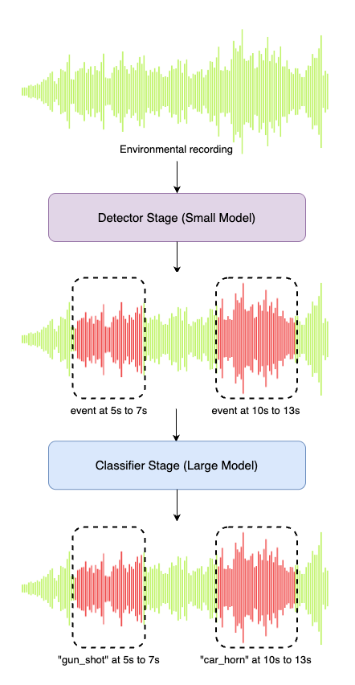

# Sound Event Detection

This repository investigates the possibility of using multi-stage detectors and classifiers for audio classification much like how R-CNN works for images.  

Our motivation is to use small detectors which can potentially be deployed on edge devices with large classifiers that may sit on large servers and can handle multiple input streams (e.g., from many detectors) at once. To this end, we want to quickly detect if there's an event, but ensure that the classification of the event is accurate as well, thus combining the speed of small models with the accuracy of large models.

## Architecture

Our proposed architecture is shown below.

## Models Used

We compared the following models and their combinations:
- Convolutional Recurrent Neural Networks (R-CNN) - single stage only
- Yet Another Mobile Network (YAMNet) - single stage and as detector
- Hierarchical Token Semantic Audio Transformer (HTS-AT) - single stage and as classifier
- Audio Mamba (AuM) - as classifier only

## Evaluation

We follow the official DCASE SED evaluation method noted here: <https://tut-arg.github.io/sed_eval/tutorial.html#id1>

## Using the Repository

### Setting Up

- Clone the repo and install the `requirements.txt` file
- As we use python_dotenv and HuggingFace, create a `.env` file in the root directory and insert your HF_TOKEN

### Training the Models
The models used in the main script are all loaded from checkpoints, so you may need to run the individual models first.  
This can be done through the individual model files' entry points in `src.models`.  

### Running Single Stage Pipeline

This requires specifying a detector model and a classification model

Example Usage: `python main.py --num-stages=2 --detector-model=yamnet --classifier-model=htsat`

### Running Two-Stage Pipeline

This requires specifying a model capable of running detection and classification together

Example Usage: `python main.py --num-stages=1 --combined-model=htsat`

### Generating Detection Data

To generate, scaper and soxbindings (from submodule, and install from source) is required. Otherwise, this can be ignored.  
- Install the requirements from `req_scaper.txt`
- Create a train and test classification folder with subfolders being the classes.
- Within `src.utils.generate_detection_events`, change the SCAPER settings if needed.
- Run `python -m src.utils.generate_detection_events` to create your SED dataset.
